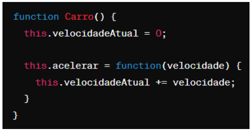
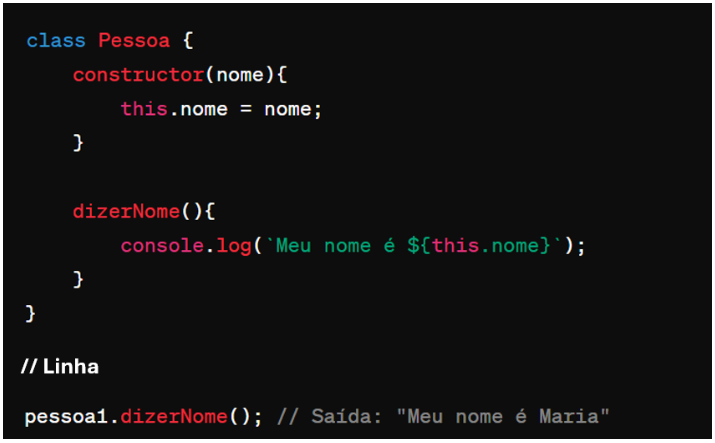

# Instruções

- Faça uma cópia deste arquivo .md para um repositório próprio
- Resolva as 6 questões objetivas assinalando a alternativa correta
- Resolva as 4 questões dissertativas escrevendo no próprio arquivo .md
  - lembre-se de utilizar as estruturas de código como ``esta aqui com ` `` ou
```javascript
//esta aqui com ```
let a = "olá"
let b = 10
print(a)
```
- Resolva as questões com uso do Visual Studio Code ou ambiente similar.
- Teste seus códigos antes de trazer a resposta para cá.
- Cuidado com ChatGPT e afins: entregar algo só para ganhar nota não faz você aprender e ficar mais inteligente. Não seja dependente da máquina!
- ao final, publique seu arquivo lista_01.md com as respostas em seu repositório, e envie o link pela Adalove. 

# Questões objetivas

**1)** O que o código a seguir faz?

R: Letra A


Escolha a opção que responde corretamente:

Xa) Imprime os números pares de 1 a 10.

b) Imprime os números ímpares de 1 a 10.

c) Imprime os números pares de 2 a 10.

d) Imprime os números ímpares de 2 a 10.

______

**2)** Identificar a linha que falta no código para criar uma classe Veiculo com atributo marca, e uma classe Carro que herda de Veiculo com um método ligar(). 

R: Letra A


No lugar onde está escrito “// linha” qual das opções abaixo deve estar para funcionar corretamente o código?

XA) let carro = new Carro("Toyota");

B) let ligar = new ligar("Toyota");

C) class Moto extends Veiculo {};

D) carro1.ligar();

______

**3)** Qual é o valor de resultado após a execução deste código?

R: Letra A


Escolha a opção que responde corretamente:

XA) 18

B) 16

C) 14

D) 12

______

**4)** Como você criaria um método `acelerar()` em uma classe `Carro`, que recebe um parâmetro `velocidade` e o adiciona a um atributo `velocidadeAtual`?

R: Letra A

XA) 

B) 

C) 

D) 

______

**5)** Qual a forma correta de definir uma classe Carro em JavaScript, com um método ligar() e um atributo marca?

R: Letra A

XA) 

B) 

C) 

D) 

______

**6)** Observe o código abaixo:


Qual será a saída do código acima?

R: Letra A

XA) "Olá, meu nome é João. Olá, meu nome é Maria."

B) "Olá, meu nome é ."

C) "João Maria"

D) "undefined undefined"

______

# Questões dissertativas

**7)** Vamos criar um programa em JavaScript para entender classes, métodos e atributos!
Classe Animal:
- Crie uma classe chamada Animal.
- Adicione dois atributos: nome e idade.
- Adicione um método chamado descrever() na classe Animal.
  - Este método deve exibir no console uma descrição do animal com seu nome e idade.

Criando e manipulando Animais:
- Crie dois objetos da classe Animal: um chamado "cachorro" e outro "gato", com idades distintas.
- Para cada animal, chame o método descrever() para ver a descrição no console.

Dica: Utilize `console.log()` para exibir as informações!

```javascript
// Definindo a classe Animal
class Animal {
    // Construtor para inicializar as propriedades comuns
    constructor(nome, idade, tipo) {
        this.nome = nome;
        this.idade = idade;
        this.tipo = tipo;
    }

    // Método para descrever o animal
    descrever() {
        return "Seu " + this.tipo + " se chama " + this.nome + " e tem " + this.idade + " anos de idade.";
    }
}

// Criando instâncias da classe Animal
let cachorro = new Animal("Rex", 3, "cachorro");
let gato = new Animal("Garfield", 2, "gato");

// Exibindo descrições no console
console.log(cachorro.descrever());
console.log(gato.descrever());
```
______

**8)** Nos últimos dias tivemos a oportunidade de ter contato com Programação Orientada a Objetos, e tivemos contato com o tema "herança". Herança é um princípio de orientação a objetos, que permite que classes compartilhem atributos e métodos. Ela é usada na intenção de reaproveitar código ou comportamento generalizado ou especializar operações ou atributos. Então vamos praticar esse conteúdo nessa questão.
Vamos criar um programa em JavaScript para entender classes, métodos, atributos e herança!

Classe Animal:
- Crie uma classe chamada Animal.
- Adicione dois atributos: nome e idade.
- Adicione um método descrever() que exiba no console uma descrição do animal com seu nome e idade.

Classe Gato (Herda de Animal):
- Crie uma classe chamada Gato que herda da classe Animal.
- Adicione um atributo extra cor específico para gatos.
- Adicione um método miar() que exiba no console o som que um gato faz.

Criando Animais:
- Crie dois objetos da classe Animal: um chamado cachorro e outro gato, com idades distintas.
- Para o gato, também defina a cor.

Chamando os Métodos:
- Para cada animal, chame o método descrever() para ver a descrição no console.
- Para o gato, chame o método miar() para "ouvir" o som que ele faz (é também para ver o som no console).

Dica: Utilize console.log() para exibir as informações!

```javascript
// Definindo a classe Animal
class Animal {
    // Construtor para inicializar as propriedades comuns
    constructor(nome, idade, tipo) {
        this.nome = nome;
        this.idade = idade;
        this.tipo = tipo;
    }

    // Método para descrever o animal
    descrever() {
        return "Seu " + this.tipo + " se chama " + this.nome + " e tem " + this.idade + " anos de idade.";
    }
}

// Criando instâncias da classe Animal
let cachorro = new Animal("Rex", 3, "cachorro");
let gato = new Animal("Garfield", 2, "gato", "malhado"); // Note: parâmetro "malhado" não é usado

// Definindo a classe derivada Gato que estende Animal
class Gato extends Animal {
    // Construtor que chama o construtor da classe pai e adiciona propriedades específicas
    constructor(cor) {
        super("Garfield", 2, "gato");
        this.cor = cor;
    }

    // Método específico para o som emitido pelo gato
    miar() {
        return "Miau!";
    }

    // Método para descrever o gato, chamando o método descrever da classe pai
    gatoDescrever() {
        return super.descrever() + " Ele é " + this.cor + ".";
    }
}

// Criando uma instância da classe Gato
gato = new Gato("malhado");

// Exibindo descrições e miado no console
console.log(cachorro.descrever());
console.log(gato.gatoDescrever());
console.log(gato.miar());
```

______

**9)** Vamos criar um programa em JavaScript para somar notas!

Classe SomadorDeNotas:
- Crie uma classe chamada SomadorDeNotas.
- Adicione um atributo total inicializado com 0 para armazenar a soma das notas.

Método adicionarNota:
- Adicione um método chamado adicionarNota(nota) na classe SomadorDeNotas.
- Este método deve receber um parâmetro nota e somá-lo ao atributo total.

Criando o Somador e Adicionando Notas:
- Crie um objeto da classe SomadorDeNotas, chamado somador.
- Utilize o método adicionarNota(nota) para adicionar algumas notas ao somador.

Chamando o Método para Ver o Total:
- Após adicionar todas as notas, chame um método verTotal() para exibir o total das notas adicionadas.

Dica: Utilize console.log() para exibir as informações!

```javascript
// Definindo a classe SomadorDeNotas
class SomadorDeNotas {
    // Construtor para inicializar a soma
    constructor() {
        this.soma = 0;
    }

    // Método para adicionar notas à soma
    adicionarNota(notas) {
        for (let nota of notas) {
            this.soma += nota;
        }
    }

    // Método para obter o total da soma
    verTotal() {
        return this.soma;
    }
}

// Criando uma instância da classe SomadorDeNotas
let somador = new SomadorDeNotas();

// Adicionando notas à instância
somador.adicionarNota([6, 7, 4, 10]);

// Exibindo o total da soma no console
console.log(somador.verTotal());
```

______

**10)** Imagine que você está criando um programa em JavaScript para uma escola. Neste programa, existem diferentes tipos de funcionários, cada um com suas próprias características. Considere as seguintes classes:

Funcionário:
- atributo: Nome
- atributo: Idade
- atributo: Salário base
- método: calcularSalario() - Este método calcula o salário total do funcionário. Para cada tipo de funcionário, o cálculo será diferente.

Professor (herança de Funcionário):
- atributo: Disciplina
- atributo: Horas de aula por semana
- método: calcularSalario() - Para calcular o salário do professor, multiplicamos suas horas de aula pelo valor da hora/aula.

Agora, sua tarefa é escrever um código em JavaScript que crie as classes Funcionário e Professor, com suas características e métodos descritos acima. Depois de criar as classes, crie:
- Dois objetos do tipo Professor com informações fictícias.
- Para cada objeto, chame o método calcularSalario() e mostre o salário calculado no console.

Certifique-se de explicar cada parte do código utilizando comentários, explicando para que serve cada atributo e método, bem como a lógica por trás do cálculo de salário para o tipo de funcionário Professor.

```javascript
// Definindo a classe base Funcionario
class Funcionario {
    // Construtor para inicializar as propriedades comuns
    constructor(nome, idade) {
        this.nome = nome;
        this.idade = idade;
        this.salariobase = 2000; // Salário base padrão para todos os funcionários
    }

    // Método para calcular o salário com base na idade
    calcularSalario() {
        return "O salário de " + this.nome + " é " + (this.salariobase * (1 + (this.idade / 100)));
    }
}

// Criando instâncias da classe Funcionario
let funcionario1 = new Funcionario("João", 20);
let funcionario2 = new Funcionario("Maria", 55);

// Definindo a classe derivada Professor que estende Funcionario
class Professor extends Funcionario {
    // Construtor que chama o construtor da classe pai e adiciona propriedades específicas
    constructor(nome, idade, disciplina, horasaula) {
        super(nome, idade);
        this.disciplina = disciplina;
        this.horasaula = horasaula;
    }    

    // Sobrescrevendo o método calcularSalario para incluir o valor das horas de aula
    calcularSalario() {
        return "O professor " + this.nome + ", que ministra: " + this.disciplina + " recebe " + (this.salariobase + (this.horasaula * 100)) + " reais";
    }
}

// Criando instâncias da classe Professor
let professor1 = new Professor("André", 60, "Matemática", 20);
let professor2 = new Professor("Golias", 25, "Física", 14);
let professor3 = new Professor("Aryana", 37, "Química", 17);

// Exibindo os salários calculados no console
console.log(funcionario1.calcularSalario());
console.log(funcionario2.calcularSalario());
console.log(professor1.calcularSalario());
console.log(professor2.calcularSalario());
console.log(professor3.calcularSalario());
```